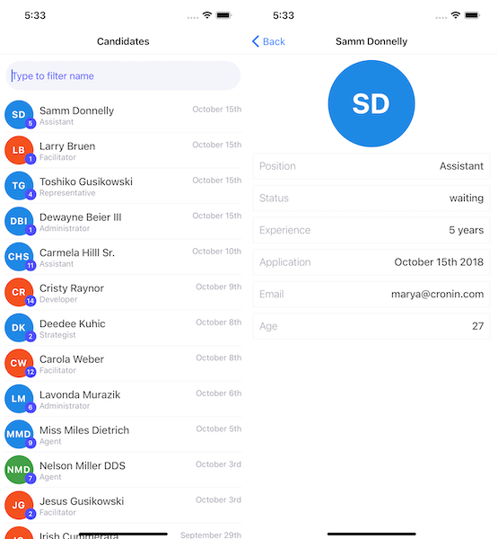
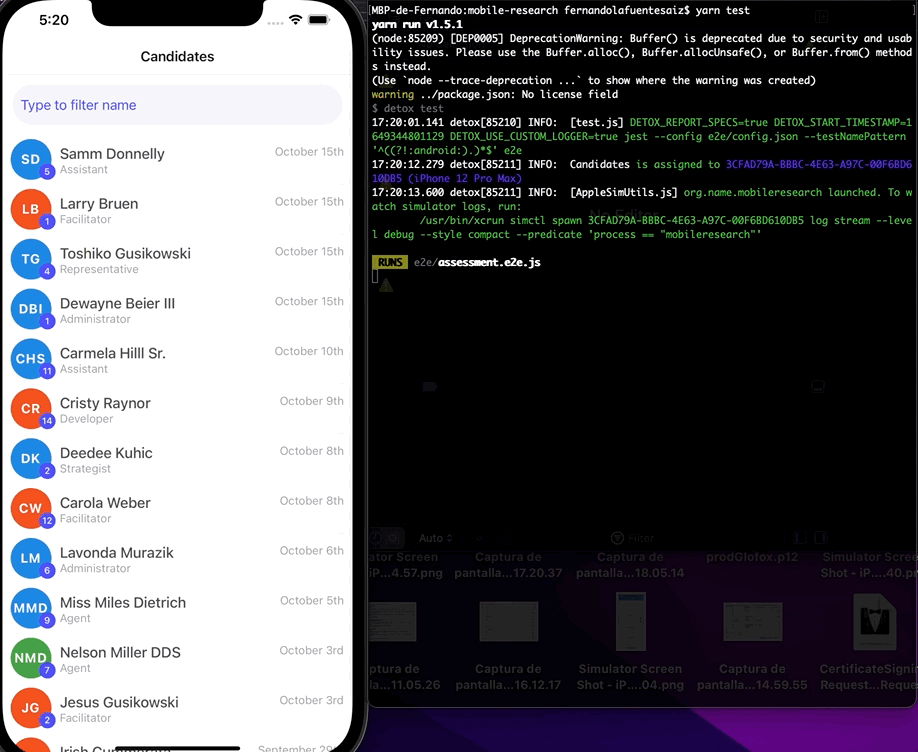

# mobile-research
<p align="center">
  
</p>

---

- [How to run the project](#how-to-run-the-project)
- [Approach](#approach)
- [Testing](#testing)
- [Additional notes](#additional-notes)

## How to run the project

### Requirements
- [Node](https://nodejs.org/)
- [Yarn](https://yarnpkg.com/)
- [React native cli](https://reactnative.dev/docs/environment-setup)
- [Cocoapods](https://cocoapods.org/)
- [Detox end to ends](https://github.com/wix/Detox)

### Installation

```
yarn install
cd ios && pod install && cd ..
yarn ios
```

*Testing with detox*

```
yarn global add detox-cli
brew tap wix/brew
brew install applesimutils
```
## Approach

The development was carried using iphone 8 and iphone 12 as deployment targets to comply with the average screen sizes. As a result ellypsis was applied to elements susceptible of overflowing.

The project is structured into 2 main screens:

### Home candidates screen
List of candidates containing what i understand is critical information:
- Application date excluding year as the list is sorted by default
- Name - with ability to filter
- Role - with ability to filter
- Avatar with background color hightlighting the application status
- Small pill next to the Avatar displaying the years of experience

Filtering combines `name` and `position` in the same InputText.

The List contains a pull to refresh feature that will reload the dataset.

Given the unstable api, the calls have retry and cache mechanisms implemented in the core `RTK-query`. The cache can be invalidated through the Pull to refresh feature from the list.

An Empty screen is present for empty result scenarios while filtering or making api calls, showing a reload button in case the empty result is followed by an error.

### Detail candidate screen

Tapping on the row elements will navigate to a detail candidate screen with the extended candidate information available.

The email section can be tapped and will open the email client to contact the candidate.

### Structure

```
glofoxapp
├── src
│   ├── api // Api connectivity and response transformation
│   │    └── index.tsx
│   ├── components // Re-usable components across the screens
│   │    ├── Avatar
│   │    │    ├── index.tsx
│   │    │    └── style.tsx
│   │    └── ...
│   ├── navigation // Navigation stack with routing
│   │    └── index.tsx
│   ├── screens // Main screens
│   │    └── ...
│   ├── store
│   │    ├── slices // Contain redux state management and selectors
│   │    │    └── ...
│   │    └── index.tsx // Middlewares
│   ├── utils
│   │    ├── candidates.mock.json // Mock candidate list
│   │    └── index.tsx // Util functions
│   └── App.tsx // Main App Component.
│
├── index.js // Main file entry point.
│
└── ...
```

## Testing

First create the build that will be used for testing:

```
yarn test-build
```

Run the tests with the following command:
```
yarn test
```

<p align="center">
  
</p>

### Mocking Api calls

Mocked api call for the `candidates endpoint` will be applied to the Debug Scheme.
The reason for this is to make the development fluent and e2e stable due to the unstable api.

## Additional notes
There are a couple of things missing due to time constrains:
- Ability for users to sort the list
- Linting rules to get consistence through code
- Snapshot tests
- Remove Expo from the project to reduce complexity
- App hasn't been launched in Android as i don't currently have the environment setup.
- Populate Accessibility property together with testID